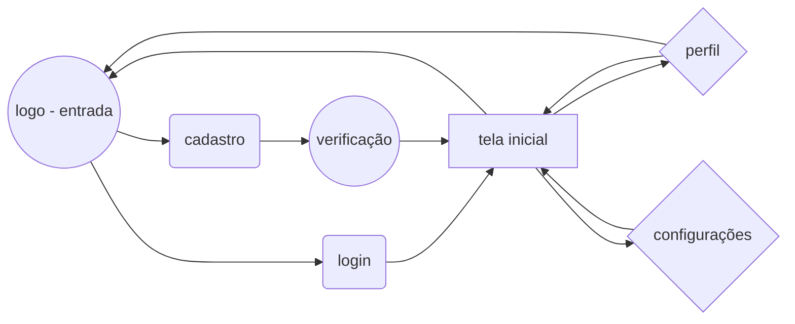

# TCC_PROJETO
[React Native](https://expo.dev)
```
Projeto para Trabalho  de Conclusão de Curso (Mobile){
  projeto só frontend
} 
```

> [job_rednit](https://snack.expo.dev/@kittymayuko/job_rednit)

> [job_rednit2](https://snack.expo.dev/@kittymayuko/job_rednit2)

### Para testar a aplicação
> 1º Primeiro baixe o [Expo - Expo Project](https://play.google.com/store/apps/details?id=host.exp.exponent&hl=pt_BR&gl=US)

> 2º Segundo abra o link do Snak.io [EstagioSwipe_Connect](https://snack.expo.dev/@kittymayuko/estagioswipe_connect), espere a aplicação rodar (caso fique vermelho, atualize o código pelo alerta de problemas) vá em My Device e escaneie o qr code com o aplicativo

> Ou caso eu (dono original) esteja rodando a aplicação, é so escanear o qr code abaixo


> 3º Caso queria dar uma olhada em quantas telas vão ficar e como vai ser de forma bem simples faça o mesmo passo acima com esse [SIMULATOR](https://snack.expo.dev/@kittymayuko/screen_1_2_3_4_1_5_6_7_1) ou olhe o mermaid abaixo do qr code


> inicialmente vai ser assim:



### Notas Gist.github
[tcc-document-github.txt](https://gist.github.com/SuellenMiranda/ac533f283ba96096728f376febe3ade7)
